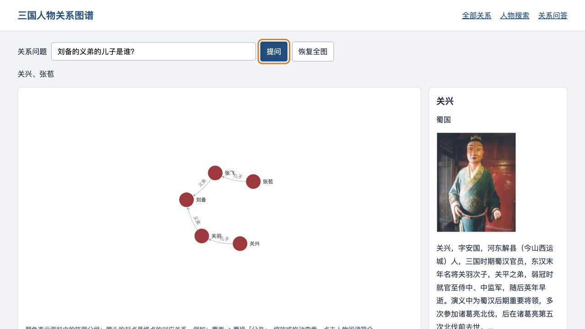

# KGQA_SG · 三国人物关系图谱

三国人物关系可视化与问答工具。当前版本使用 Python 3.14.7、Flask 和 ECharts 6.1.0，提供全图浏览、人物搜索、人物简介及一至两层关系问答。

默认使用仓库内的 **122 个人物、146 条去重关系**，无需 Neo4j、LTP 模型、爬虫或外部 API。Python 使用 uv 管理并锁定依赖；浏览器资源随仓库提供，页面不依赖 CDN。



## 快速开始

先按照 [uv 官方安装说明](https://docs.astral.sh/uv/getting-started/installation/) 安装 uv。本文命令在仓库根目录执行。

```bash
uv python install
uv sync --locked --no-dev
uv run --locked --no-dev python app.py
```

访问 <http://127.0.0.1:5000>。首次安装需要网络，之后页面使用本地数据和静态资源。Node.js 只用于维护前端依赖，运行应用不需要安装。

应用默认仅监听本机，关闭调试器。这是本地学习工具；Flask 开发服务器不能直接作为公网生产服务。公网部署需要另行配置生产 WSGI 服务、HTTPS、访问控制及限流，本仓库不提供生产部署配置。

## 使用方式与数据边界

- **全部关系**：按阵营分组上色；拖动、缩放，点击节点查看简介。也可以展开图下的人物列表，用键盘选择人物。
- **人物搜索**：输入“曹操”“刘备”等仓库内姓名，显示与该人物直接相连的关系。
- **关系问答**：“曹操的爸爸是谁？”返回曹嵩；“刘备的义弟的儿子是谁？”返回关兴、张苞，保留两条匹配路径。

箭头含义是“起点是终点的某种关系”，例如 `曹嵩 → 曹操：父亲`。问答沿匹配关系的反方向寻找人物，支持“爸爸/父亲”“妻子/妻”等明确同义词。这是有限语法匹配，不是通用自然语言理解、LLM 或开放域问答。无法匹配的问题给出明确提示，不臆造答案。

数据沿用历史教学资料，**未完成史料核验**：阵营归属、称谓、关系完整性可能有误，简介可能截断。例如原始资料仍把曹丕分在吴国、诸葛瑾分在蜀国，尚待单独的数据校订。无匹配只说明资料没有记录。

## 数据与代码

| 路径 | 用途 |
| --- | --- |
| `app.py` | 页面、JSON 接口、安全响应头和输入限制 |
| `graph_data.py` | 校验并只读加载本地关系、简介与画像 |
| `raw_data/triples_processed.txt` | 运行时的规范关系数据：起点、终点、关系、起点阵营、终点阵营 |
| `data/profiles.json`、`data/portraits/` | 与图谱人物一一对应的 122 份简介和 122 张画像 |
| `KGQA/ltp.py` | 有限关系语法解析器，不需要外部 NLP 模型 |
| `neo_db/query_graph.py` | 本地单人查询及多分支关系问答 |
| `neo_db/creat_graph.py` | 可选的 Neo4j 导入命令，导入模块本身不写数据库 |
| `templates/graph.html`、`static/js/graph.js` | 无 jQuery/Bootstrap 的页面及交互 |
| `scripts/`、`tests/` | 依赖审计、静态资源校验与回归测试 |

修改关系数据后，重新生成兼容的静态快照，并重启应用以清空只读缓存：

```bash
uv run --locked --no-dev python -m neo_db.neo2json
```

`static/data.json` 是派生文件；页面实际使用 `/graph_data`。三国原始关系表保留在 `raw_data/triples.csv` 供数据核对，不参与运行；修改关系时以 `triples_processed.txt` 为准。

## 可选依赖

Neo4j 仅用于可选的图数据库导入，日常运行不需要：

```bash
uv sync --locked --extra neo4j       # 可选图数据库导入
```

Neo4j 导入使用官方驱动，密码由环境变量提供，不再在源码中保存：

```bash
export NEO4J_URI=bolt://localhost:7687
export NEO4J_USER=neo4j
# 通过你自己的安全方式设置 NEO4J_PASSWORD；不要提交到仓库。
uv run --locked --extra neo4j python -m neo_db.creat_graph
```

可选 `NEO4J_DATABASE` 默认是 `neo4j`。此命令**会写入你配置的数据库**：用参数化 `MERGE` 写入专用 `KGQASGPerson` 节点和带 `relation` 属性的 `RELATED_TO` 边，可顺序重复执行，不清空已有数据库。它不会迁移或删除旧 `Person` 节点；先备份并选择正确数据库。网页目前查询本地资料，不读取 Neo4j。测试验证了参数传递和不删除的查询语句，未连接真实 Neo4j 实例进行集成验收。

## 开发与安全检查

维护前端资源需要 Node.js 24。首次同步全部可选组：

```bash
uv sync --locked --all-extras --all-groups
uv run --locked --all-extras --all-groups pytest -q
uv run --locked ruff check .
npm ci --ignore-scripts
uv run --locked python scripts/vendor_assets.py --check
npm audit
uv run --locked python scripts/audit_dependencies.py
```

Python 审计覆盖 `uv.lock` 中**全部第三方包**，包括开发工具、可选 Neo4j 和其他平台的依赖；不能成功扫描的包会使检查失败。npm 审计覆盖前端锁文件，vendor 校验将仓库实际加载的 ECharts 字节与安装包、版本清单、SHA-256 对比。没有忽略任何 advisory。

GitHub Actions 在 push、PR 和每周执行检查；Dependabot 每周检查 uv、npm、Actions 更新。工作流只有只读仓库权限，不会自动合并或部署。

更新 Python 依赖后运行 `uv lock --upgrade`。

更新 ECharts 时，修改 `package.json` 中的精确版本，执行 `npm install --ignore-scripts`，然后：

```bash
uv run --locked python scripts/vendor_assets.py
```
