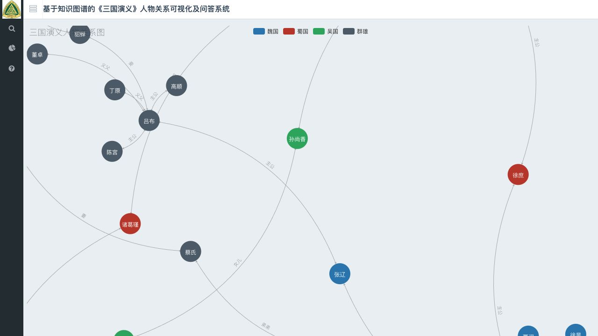

# KGQA_SG 全面检查与现代化建议

> 这是修复前的审计快照。后续已按安全修复请求更新应用和依赖；当前改动及验证结果请看[安全修复记录](security/remediation-2026-08-31.md)。下面保留原始发现，便于追溯，不代表修复后的状态。

检查日期：2026-08-31。项目基准：`7c3966a`（2018-11-28）。参考项目：本机 `news-graph` 的 `3d7ba10`，以及当天的现代化提交 `9dc78e8`。

本次是审查，不是改版：只新增本报告、检查摘要和截图，没有修改应用、原始数据、依赖配置或参考项目，没有连接或清空 Neo4j，没有运行爬虫。候选依赖安装和 JSON 语法修正实验均在临时目录完成。

**建议先修数据和功能，再升级环境与展示。** 当前问题不只是依赖老旧：唯一已宣称实现的全图页面，其 JSON 已损坏；搜索、问答和资料仍混用红楼梦代码。适合的第一版目标是“可直接体验的三国人物图谱 + 有明确边界的关系查询 + 可选 Neo4j 教程”，而不是同时引入复杂前端框架和大模型。

## 1. 实际状态与验证范围

| 检查项 | 结果 |
| --- | --- |
| 代码规模 | 12 个 Python 文件，4 个 HTML 模板，2 本 Notebook；第一方 Python 约 660 行，适合局部整理 |
| Python 历史信息 | Notebook 元数据为 3.6.4；仓库没有声明支持版本，不能据此认定所有代码只支持 3.6 |
| Python 依赖 | `requirements.txt` 有 49 项，混合应用、爬虫、Notebook、测试及间接依赖 |
| 原始三国关系 | `raw_data/triples.csv` 有 153 行，其中 7 行完全重复 |
| 清洗后三国关系 | `raw_data/triples_processed.txt` 有 122 人、146 条关系、31 种关系标签，无完全重复行；仍有分类问题 |
| 页面图谱 | `static/data.json` 不是合法 JSON；仅在内存修正语法后可统计出 122 节点、153 条边，其中 7 条完全重复 |
| 三国资料 | `notebooks/data.json` 的 122 份简介覆盖清洗后全部人物；值为字符串 |
| 应用实际读取的资料 | `spider/json/data.json` 的 105 份资料与三国人物交集为 0；值为字典 |
| 三国图片 | `notebooks/images/` 有 121 张，缺曹嵩；另有 `notebooks/曹嵩.jpg`，未进入统一目录 |
| 应用实际读取的图片 | `spider/images/` 的 180 张 JPG 与三国人物交集为 0 |
| 工程保障 | 未发现测试文件、CI、`pyproject.toml`、`uv.lock` 或项目根目录许可证 |

机器可读摘要及关键数据文件 SHA-256 见 [check-results.json](audit-assets/check-results.json)。上述页面数据统计都以“只在内存将 `0l` 改成 `0`”为前提，不能理解为当前页面能正常加载这些数据。

本次执行的验证：

- 全部 Python 文件在本机 Python 3.9.6 和临时验证使用的 3.14.7 下通过语法解析；这不代表依赖或业务逻辑兼容。
- 使用标准库解析 JSON、CSV、Notebook，核对节点、边、重复项、分类、图片及简介覆盖率。
- 从源文件提取原函数，用替身数据库和分词结果复现失败；未执行数据库连接初始化或建图模块。
- 在 Python 3.14.7 候选环境用 Flask test client 检查真实路由；替换数据库、旧 NLP 和未使用的缓存包导入。四个页面返回 200，三国搜索、三国资料、空问答、未支持关系问答分别复现 500。
- 浏览器通过本机静态服务器检查原模板及资源；另检查仅修正 JSON 语法的临时副本，包括 1280×720 桌面和 390×844 手机视口。模板导航中的 Jinja 表达式未由静态服务器渲染，因此没有把这次浏览器检查当作 Flask 全站端到端测试。
- 在临时目录用 uv 安装 Python 3.14.7 对应环境：Flask 3.1.3、Neo4j 驱动 6.3.0、Jinja2 3.1.6、Werkzeug 3.1.8；四个模板均可渲染，官方驱动可导入、构造并关闭，未发起数据库连接。

未验证真实 Neo4j 导入/查询、旧 LTP 模型推理、爬虫当前可用性、Windows/Linux 安装、依赖漏洞全量扫描或关系的逐条文献准确性。没有宣称旧环境已还原，或整个应用已适配 Python 3.14。

## 2. 优先修复的问题

P1：影响主要功能、结果正确性或数据安全，应在改版第一轮解决。P2：可靠性、体验和维护成本问题。

| 优先级 | 发现与代码位置 | 影响 | 建议与验收 |
| --- | --- | --- | --- |
| P1 | `static/data.json:1` 的钟会节点写成 `"category": 0l`，解析错误位于第 2409 列；`templates/all_relation.html:135–143` 无加载失败处理 | JSON 请求回调不成功，全图静默空白 | 由唯一数据管线生成合法 JSON；所有提交的 JSON 可解析，加载失败显示可理解的提示；不能只手工补一个字符就视为数据管线修复 |
| P1 | `neo_db/creat_graph.py:4–16` 在模块顶层执行 `MATCH (n) DETACH DELETE n`，随后逐条导入 | 一旦执行成功，会删除所连接数据库内全部节点，包括无关数据；中途失败还会留下不完整结果 | 移入显式命令入口，默认幂等导入；清空操作必须单独显式选择并限定数据集；先验证全部输入，再在事务内写入；重复运行不增边、不删其他数据 |
| P1 | `neo_db/query_graph.py:9–12,58–60`、建图脚本使用字符串格式化拼 Cypher | 人名中的单引号会破坏查询；请求输入进入 Cypher 语法，存在注入风险 | 参数化名称、关系值和批量数据；关系类型固定为如 `RELATED_TO` 并用属性存谓词，或严格白名单；测试带引号输入只作为值传递 |
| P1 | `neo_db/config.py:7` 是红楼梦分类，`query_graph.py:35` 直接索引；资料和图片路径仍指向 `spider/` | 正常三国记录复现 `KeyError('魏国')`；曹操资料为 `KeyError` / `FileNotFoundError` | 统一人物数据、分类与资源读取；搜索和详情消费同一份三国数据，122 人都可查看详情，缺图有占位 |
| P1 | `notebooks/data.json` 是字符串简介，`spider/show_profile.py:8–10` 要求字典 | 仅替换文件路径仍会 `TypeError: string indices must be integers` | 明确详情结构，例如 `name/summary/image`；返回结构化 JSON，前端以文本渲染；不要继续返回拼装 HTML |
| P1 | 两份预处理脚本和 Notebook 各自维护名单；页面 JSON 未随清洗结果更新 | 清洗后 146 条关系与页面 153 条不同；页面仍用夏侯淳，清洗后为夏侯惇；曹丕分类也不一致 | 收敛为一个可重复执行的数据生成入口；Notebook 调用它；生成产物与源数据语义一致，稳定排序后重复生成无差异 |
| P1 | `notebooks/data_preprocessing.py:23–25` 将曹丕列入吴国；`triples_processed.txt:141–142` 已继承；诸葛瑾在清洗数据中标成蜀国 | 可视化颜色和后续筛选会传递错误/未说明的分类 | 按人物表集中维护分类；仓库简介已把曹丕描述为曹魏皇帝、诸葛瑾描述为吴国重臣，先解决内部矛盾，再审校其他人物；记录分类依据及是否只是展示分组 |
| P1 | `KGQA/ltp.py:37` 无条件取第二个分词；`query_graph.py:50–72` 无条件取最后一个答案，并直接索引关系词表 | 0/1 个分词、空答案、未知关系均可崩溃；31 种三国关系中 20 种不在原问答词表内，包括主公、义父、师傅 | 定义支持的语法和词表；空输入、未知人物、未知关系、无匹配各有明确响应，不能 500；区分“未支持”与“数据库无记录” |
| P1 | `query_graph.py:56` 多跳只沿 `data_array[-1]` 继续，最后也只显示一个人物简介 | 一跳返回多人时丢弃其他分支，结果取决于数据库返回顺序；查询中途断路也可能出错或返回旧节点 | 每跳保留全部候选与路径，或第一版明确只支持单跳；测试多子女、两跳分叉、第二跳无结果以及候选顺序变化 |
| P1 | `app.py:2,4–5` 启动时导入全部依赖；`KGQA/ltp.py:4` 为私人绝对模型路径；`neo_db/config.py:2` 顶层创建连接 | 即使只想看静态全图，也需要旧数据库/NLP/缓存依赖；克隆后不能直接体验 | 默认展示与简单查询不依赖 LTP 或数据库；可选功能按需加载；模型路径与数据库配置来自显式配置，缺失时只影响相关功能 |
| P2 | `templates/all_relation.html:176–179,222–224` 重复定义 `force`，第二处覆盖第一处；另两个图表模板也有相同问题 | 预期的排斥力和边长配置未按第一段设置生效，调参容易误判 | 图表配置只保留一处；布局、筛选和详情逻辑集中维护；实际渲染验证覆盖初始视图、resize 和 reset |
| P2 | `query_graph.py:18–35` 与 `neo2json.py:28–44` 使用集合遍历和数组下标生成身份；每轮重复去重，代码重复 | 相同数据重导出后节点顺序不稳定，无法可靠保存选择/位置，也难审阅 JSON 差异 | 使用持久人物 ID，显示名字独立；稳定排序，按 `(source, target, predicate)` 去重；不把不同关系合为同一条 |
| P2 | 多个脚本依赖当前工作目录；建图 `from config import graph` 与输入 `./raw_data/…` 的相对路径难以由同一工作目录满足 | README 所说切换到 `neo_db` 再运行会找不到原始数据；换目录调用资料或导出也易失败 | 用 `Path(__file__)` 定位仓库资源；统一从仓库根目录执行的模块入口；测试从其他工作目录读取资源和指定输出路径 |
| P2 | `notebooks/crawl-character-image-and-introduction.py` 顶层爬取、请求无超时与状态检查，指定 `lxml` 解析器；依赖文件未直接列出 `requests/lxml` | 导入脚本就联网，可能挂起或把错误响应写成图片；环境依赖不完整 | 爬虫不进入默认启动链；显式入口、超时、状态/内容类型检查、有限重试和速率限制；保存来源；不实际重爬也应能体验已有样例 |
| P2 | `app.py:52` 开启 debug；凭据写死；`query_graph.py:74` 拼接用户输入到文件路径；详情 HTML 无转义后由 `.html()` 注入 | 公开部署时有额外风险；资料路径和爬取文本缺少清晰边界 | 默认关闭 debug、配置用环境变量、人物 ID 白名单映射图片、文本安全渲染；当前 `app.run()` 默认本机监听，不能据此声称已对公网暴露 |

关于安全验证的边界：本次用 `O'Connor` 捕获到原样插入的查询字符串，未对真实数据库执行注入；文件路径拼接和资料 HTML 是代码风险，未证明能完整利用为任意文件泄露或线上脚本执行。2018 年的依赖和静态资源应更新，但未做漏洞数据库扫描，不提供臆测的 CVE 数量。

## 3. 数据整理比换图形库更重要

目前存在几条各自演进的链：

```text
raw_data/triples.csv
  ├─ KGQA/process_raw_data.py
  ├─ notebooks/data_preprocessing.py
  └─ notebooks/data-cleaning.ipynb
        ↓
  triples_processed.txt → Neo4j → neo2json.py → static/data.json

三国简介/图片：notebooks/data.json + notebooks/images/
应用详情接口：spider/json/data.json + spider/images/（红楼梦）
```

第一轮建议保留原始文件作来源记录，新增一份统一人物表和一份规范关系表，再从中生成前端与可选 Neo4j 导入数据。不要再在爬虫、Notebook、后端和前端各复制一份阵营名单。

最小数据约定即可，不需要先建设通用知识图谱平台：

- 人物：`id/name/aliases/faction/summary/image`。别名与错别字校正应人工确认；阵营字段说明其时间或展示约定，不能把徐庶、糜芳等复杂经历解释成永恒国籍。
- 关系：`source/target/predicate`，明确“source 是 target 的什么”。例如现有 `曹嵩 → 曹操 / 父亲` 表示曹嵩是曹操的父亲，不是“曹嵩的父亲是曹操”。
- 同一人物对可有多种关系，如曹操与夏侯惇的“主公”“同族”。只删完全重复，不按端点粗暴去重。
- 关系同义词如妻/妻子、夫/丈夫，以及逆关系如父亲/儿子需要明确规则，不能机械添加全部反向边：父亲的孩子不一定是儿子。
- 数据来源、校正依据、历史事实与小说设定分别记录；没有资料支持的关系不能用漂亮图表包装成已经核实的事实。

原始三元组已有英文 `relation` 与中文 `label`，预处理直接丢掉英文列。整理时可将英文关系名用作稳定谓词 ID，中文标签用于显示，前提是先核对语义。无需给每条边增加未经校准的置信度。

## 4. 可视化的具体改进方向

原始全图页实际为空，见 [原始页面截图](audit-assets/original-empty.png)。下图来自**只在临时副本修正 JSON 语法**后的旧界面，没有替换引擎、清理重复关系或美化布局。



当前捆绑 ECharts 3.6.2、jQuery 2.2.4、Bootstrap 3.3.6。旧布局同时展示所有标签，全部节点大小固定、关系线弯曲度相同；图谱超出初始视野，缺少显式“适应全图/重置”控件。三个模板使用同步 AJAX，没有失败和空数据的交互状态。全图有阵营图例、缩放、拖动和邻接高亮，不应把已有能力列成“完全不存在”。

手机视口没有横向页面溢出，但图表仍固定高 800px，标题与图例拥挤，多数节点不在初始可读范围。见 [390px 手机截图](audit-assets/legacy-mobile-json-only-fix.png)。

| 维度 | 第一版建议 | 验收方式 |
| --- | --- | --- |
| 页面结构 | 以图谱为主界面，顶部搜索和筛选，右侧人物/关系详情；手机详情放图下方或可展开面板 | 首屏能直接找到曹操或刘备，不先经过红楼梦欢迎页 |
| 搜索和筛选 | 姓名/已确认别名搜索、阵营筛选、关系类型筛选；选中人物可聚焦一跳邻居 | 搜索定位与详情同步；取消筛选可恢复全图；键盘可操作 |
| 节点 | 稳定阵营颜色、外置名字、选中态；可按不同邻居数量适度缩放大小并设上下限 | 图例说明大小是连接数而非历史重要性；姓名不因节点小而被截断 |
| 边 | 有向亲属/君臣关系保留方向；多重关系错开曲线；对称关系单独约定；默认弱化标签，选中时完整展示 | “父亲”的方向能通过详情句子核对；多关系不互相覆盖或丢失 |
| 布局 | 自动 fit、重置、稳定初始排序/位置；分开不连通组件，搜索后聚焦邻域；必要时提供全图和人物局部视图 | 桌面与手机初始不只看到边缘节点；resize 后仍可恢复视图 |
| 信息密度 | 全图显示主要姓名，局部显示完整姓名和关系；可选择“仅看亲属/仅看君臣” | 122 人数据能顺畅筛选和定位，不追求所有 146 条标签始终可见 |
| 资料 | 接入已有三国简介与头像，缺图占位，显示数据来源；边详情用完整自然语言解释 | 122 人不会因缺图/简介格式而抛错；简介以文本显示 |
| 错误与可访问性 | 异步加载；loading/error/empty 分开；文本人物列表、按钮语义、焦点状态、颜色外的文字说明 | 损坏 JSON、空筛选、键盘及触屏分别实测 |
| 导出 | 第一版优先离线单文件 HTML；结构化 JSON/CSV，图片导出按需加入 | 断网打开导出 HTML 仍能搜索筛选；人物和关系数与源数据一致 |

**引擎建议：优先借鉴 `news-graph` 的 G6 + 原生 JavaScript，但这是维护取舍，不是性能测评结论。** 两个项目可共用资源固定、布局工具、详情面板和导出测试经验，不必引入 React、TypeScript、npm 构建。现有 `news-graph` 将 G6 5.1.1 浏览器包、许可证、哈希及更新步骤记录在 `web/vendor/README.md`，可照此维护。

另一条可行路线是保留 ECharts 思路并升级到现代版本，改动通常更集中；官方已有 [ECharts 6](https://echarts.apache.org/handbook/en/basics/release-note/v6-feature/)。如果目标主要是修复可用性，可不立即换库。若重做交互并希望与参考项目一致，G6 更适合统一维护；其[边模型与箭头配置](https://g6.antv.antgroup.com/en/manual/element/edge/overview)可表达这里的有向关系，仍需实测多边布局。

**不能直接复制 `news-graph` 的边合并和布局假设。** 新闻默认边是无向共现，三国是有谓词、有方向的关系；这里的旧数据经语法修正后形成 119 人和 3 人两个连通分量，也远大于参考截图里的 19–20 节点图。参考项目的小图径向布局不保证直接适用于此图，更不能承诺无交叉。

## 5. Python、uv 和依赖方案

截至检查日，Python 最新稳定版为 **3.14.7**，3.15 仍处于预发布阶段，适合与 `news-graph` 一样先验证并支持 3.14。[Python 官方版本列表](https://www.python.org/downloads/)、[3.14.7 发布说明](https://www.python.org/downloads/release/python-3147/)。

uv 迁移必须同时整理直接依赖，不能把旧 49 项原封不动搬进 `pyproject.toml`。本机 uv 为 0.9.11，本次用它配合已经存在的 3.14.7 解释器完成候选安装；未升级系统工具。以后新解释器的自动下载需要 uv 自带的版本清单足够新，维护文档应说明更新 uv。[uv Python 管理](https://docs.astral.sh/uv/guides/install-python/)。

| 现有依赖/组件 | 建议 |
| --- | --- |
| Flask 1.0.2 | 保留 Flask 即可，不必为了现代化换 Web 框架；3.1.3 已在本机候选环境验证模板渲染，路由逻辑另修 |
| py2neo 4.1.0、neo4j-driver 1.6.2 | 旧 `py2neo` 已 EOL，若保留 Neo4j 功能应迁移官方 `neo4j`；本次验证 6.3.0 的安装/导入，不是旧数据库兼容性验证 |
| pyltp 0.2.1 | 从默认运行链移开；上游对 PyLTP 只做有限维护，推荐 LTP 4，但后者不是直接替换包名即可兼容的方案 |
| pandas、numpy、mkl-* | 当前主要处理小型 CSV，生产生成流程可用标准库 `csv/json`；教学 Notebook 若继续用 pandas，可放独立依赖组 |
| Jupyter/IPython 相关 | 仅 Notebook 教学时安装，不进入查看图谱的默认环境 |
| requests、BeautifulSoup、lxml | 保留爬虫时单独声明；只用标准库解析器也可省去 lxml，但需要验证解析行为 |
| Flask-Caching | 当前导入但缓存代码已注释；删除无用依赖入口即可，不必先添加 Redis |
| pytest/Ruff/审计工具 | 放开发依赖组；先用行为测试覆盖真实错误，再逐步整理风格，避免全库无关格式变更 |
| 浏览器 JS/CSS | uv 不管理手工放入的前端 bundle；固定版本、来源、哈希、许可证并记录更新验证步骤 |

依赖状态依据：[py2neo 上游归档说明](https://github.com/neo4j-contrib/py2neo)、[Neo4j 官方驱动](https://neo4j.com/docs/api/python-driver/current/)、[PyLTP 官方包说明](https://pypi.org/project/pyltp/)、[Flask 官方包](https://pypi.org/project/Flask/)。PyLTP 0.4.0 的现有 wheel 列表也不能作为 Python 3.14 可用的证据；本次没有尝试编译旧 LTP。

下面是**建议配置草案，不是已应用或完整验证的项目环境**。假设采用“Flask 默认读取本地规范数据，Neo4j 教程按需启用”，则运行直接依赖可以很少：

```toml
[project]
name = "kgqa-sg"
version = "0.1.0"
description = "Explore Three Kingdoms character relationships."
readme = "README.md"
requires-python = ">=3.14,<3.15"
dependencies = ["flask>=3.1.3,<4"]

[project.optional-dependencies]
neo4j = ["neo4j>=6,<7"]

[dependency-groups]
dev = ["pytest", "ruff", "pip-audit"]

[tool.uv]
package = false
```

版本范围只覆盖首批计划验证的 Python 次版本；将来通过其他版本 CI 后再扩大。许可证需先确认来源授权，不能因为参考项目使用 MIT 就直接照搬 `license = "MIT"`。

实施时提交 `.python-version`（`3.14.7`）、`pyproject.toml`、`uv.lock`。注意现有 `.gitignore:82` 正在忽略 `.python-version`，需要移除这一条；保留 `.venv`、缓存、`.env` 的忽略规则，若新增 `.env.example` 应确保可提交且不含真实凭据。

迁移完成后再将以下命令写入快速开始，**当前仓库还不能直接执行这组命令完成启动**：

```sh
uv sync --locked
uv run --locked python app.py

# 开发检查；依赖组及对应配置/测试需先建立
uv run --locked pytest
uv run --locked ruff check .

# 只有学习 Neo4j 导入/查询时才安装
uv sync --locked --extra neo4j
```

依赖更新使用 `uv lock --upgrade`，随后 `uv sync --locked` 和回归验证。CI 使用 `--locked` 检查声明与锁文件一致；不要在 uv 管理的环境中另用 pip 悄悄追加未声明依赖。[uv 锁定与同步](https://docs.astral.sh/uv/concepts/projects/sync/)、[uv GitHub Actions](https://docs.astral.sh/uv/guides/integration/github/)。

## 6. 架构、问答与性能

**建议保留三个简单职责：数据加载/校验、关系查询、图表展示。** 第一版不必移动所有文件到复杂包结构，也不需要仓储接口、插件系统或双后端自动切换。

```text
统一人物/关系数据
  ├─ 本地加载与校验 → Flask：搜索、单跳问答、人物详情
  ├─ 标准库导出 → 离线 HTML + 本地固定 G6 资源
  └─ 可选显式命令 → Neo4j：建图与 Cypher 教程
```

122 人、146 条关系可以在进程内构造人物字典和邻接索引。默认体验不必要求用户配置数据库、Java 和 NLP 模型。若项目定位明确需要数据库教学，则保留教程、导入器和对应集成测试，不必删除 Neo4j 方向；服务端版本、认证、备份与安全导入应单独写清楚，不能原地升级未知旧库。

当前问答实际上是“分词 → 取词性 → 关系词映射 → 按顺序查边”，并没有开放域推理。第一轮可用已知人物及别名字典、关系词表和少量明确句型覆盖，例如“曹操的父亲是谁”。它应给出来自数据的答案和路径，不能把无记录解释成历史上不存在该关系。

多跳问答应在单跳、方向、候选分支测试可靠后加入。对“刘备的儿子有哪些”等多答案请求返回全部候选；对不支持的问句解释支持范围。若以后确需更自由的自然语言，可独立比较现代 LTP 或其他解析器，并固定模型版本、下载来源、校验和与评估样例；不要立即加入未经验证的 LLM 自动补边。

性能最有价值的改动是去掉每问一次就重新加载分词和词性模型、前端同步请求，以及逐条数据库往返。若使用数据库导入，可用 `UNWIND` 批处理、人物唯一约束和关系 `MERGE`；如果默认是本地只读索引，则不用这些服务设施。当前没有基准证明需要多进程、GPU 或缓存平台。

## 7. 测试、CI 与维护

第一批回归围绕本次发现建立，避免只有“函数被调用”或截图存在这样的检查：

| 层次 | 最低测试内容 |
| --- | --- |
| 数据 | 所有 JSON 可解析；人物 ID 唯一；关系端点存在；标签/分类受支持；无完全重复边；曹丕、诸葛瑾、夏侯惇等已确认校正有回归；导出与规范数据一致 |
| 资源 | 122 人均有简介或明确缺失状态；曹嵩图片位置归一或占位；从任意工作目录可加载；图片路径不能由请求直接指定 |
| 查询 | 曹操父亲、多人答案、未知人物/关系、无答案、单字/空输入；两跳分叉与断路；查询顺序变化不改变答案集合 |
| Web/API | 页面和静态资源可用；参数校验；结构化状态码和错误；无意外 500；单引号与 HTML 特殊字符安全往返 |
| 可视化 | 搜索、阵营/关系筛选、邻域、详情、重置、resize；有向边与多重边正确；键盘操作、390px 手机和离线打开 |
| 导出 | Unicode、引号、`</script>` 等不能破坏内联 JSON/HTML；输出路径和覆盖规则明确；断网后功能仍可用 |
| 可选 Neo4j | 独立临时数据库；重复导入幂等、事务失败回滚、不删无关节点；绝不对用户数据库运行清空测试 |

CI 先用 Python 3.14 + uv 锁定同步 + 数据校验 + pytest/Ruff。再对明确承诺的平台补安装冒烟验证。可选数据库集成任务与默认轻量检查分开；前端布局可以参考 `news-graph` 的 Node 内置测试，但 Node 不应因此成为最终用户看图的必需环境。

依赖和前端资源分开更新、分别验证。漏洞扫描是后续需要补齐的工程检查，不以“本次安装成功”代替。Notebook 应可重启内核后从上到下执行；目前执行序号不连续、名单重复，应改为调用生产数据处理函数，网络抓取则明确标注为可选步骤。

## 8. 文档与来源需要补齐什么

| 文档位置 | 建议内容 |
| --- | --- |
| README 顶部 | 项目名称、三国人物图谱用途、实际完成范围；说明搜索/问答是有限关系查询；放真实截图和数据规模 |
| 快速体验 | 无数据库演示或离线 HTML；准确列出 uv、Python、启动命令、浏览器地址及首次联网需求 |
| 数据说明 | 哪份文件是事实来源，哪份是生成结果；31 种关系如何规范化，方向怎么读；历史事实与小说设定的边界 |
| 可视化使用说明 | 颜色、节点大小、箭头、筛选、邻域、重置与导出；不把位置解释成时间或因果 |
| Neo4j 教程 | 可选安装、固定并验证的服务端/驱动组合、配置示例、幂等导入、查询例子、数据备份与清空范围 |
| 问答说明 | 支持的句型和别名、多答案、未知/无记录、是否支持多跳；不宣传未完成的能力 |
| 开发说明 | 测试、数据再生成、锁文件更新、前端 bundle 更新、截图重现步骤 |
| 排错说明 | 依赖/模型缺失、端口、数据库不可用、图片缺失、JSON 解析失败、目录错误 |
| 贡献与版本 | 简短贡献流程、变更记录；明确数据修正要提供依据，不能只改最终 JSON |
| 许可证与归属 | 保留 KGQA_HLM 来源说明，核对继承代码、Nifty 模板、JS/字体和爬取图片/简介各自的授权与署名；未做法律结论，不直接套用参考仓库 MIT |

现有 README 的主体说明几乎全部藏在 HTML 注释里，且含 `requirement.txt` / 实际 `requirements.txt`、`create_graph.py` / 实际 `creat_graph.py` 的不一致，以及过时 Java/LTP 安装步骤。更适合按新的运行方式重写，而不是简单取消注释。页面上的红楼梦、旧毕设名称等产品文案应改为三国项目，同时把原作者与上游致谢保留在恰当位置。

## 9. 从 news-graph 借鉴什么

这里参考的是当天**改进后的代码和 README**，不是把它早先审查报告中的待办视为已实现功能。

| news-graph 现状 | KGQA_SG 的对应做法 |
| --- | --- |
| `.python-version` 固定 3.14.7，`pyproject.toml` 限定 3.14，提交 `uv.lock` | 复制环境可复现的管理方式，依赖按本项目重选 |
| 原生 JS + G6 5.1.1 固定本地浏览器包，无前端构建要求 | 复用这种交付形式，保留有向多关系语义；不复制共现边合并规则 |
| 搜索、类型筛选、邻域、详情和键盘实体列表 | 改为三国姓名/别名、阵营/关系筛选、人物与边详情 |
| 每份 HTML 包含脚本、样式、数据与原文，可离线分享 | 包含所需人物/关系数据；画像按体积和授权决定是否内嵌；说明导出包含哪些资料 |
| `web/vendor/README.md` 记录来源、版本、哈希、许可证 | 为 G6 及其他保留资源建立同样记录 |
| Python 导出回归 + Node 布局测试 | 增加数据一致性与关系方向测试，保留浏览器交互冒烟 |
| 三组真实截图，明确图的语义和抽取限制 | 提供全图、曹操/刘备邻域、关系问答三个可复现样例，公开已知数据和功能限制 |

没有在 `news-graph` 中看到 CI 配置，因此本报告建议的 CI 属于两个项目都可继续加强的地方，不是参考项目已经具备的能力。

## 10. 分阶段实施与验收

| 阶段 | 改动范围 | 完成标准 |
| --- | --- | --- |
| 1：恢复可信基础 | 唯一数据入口；修正 JSON、去重和命名；核对阵营；隔离删除操作与外部依赖；修复三国资料和基本查询；加关键回归 | 页面不空白；122 人、当前 146 条规范关系可校验；无红楼梦业务数据串入；未知/无结果不 500；不会自动清库 |
| 2：现代运行环境 | Python 3.14.7 + uv；精简直接依赖；默认无数据库/旧模型依赖；Neo4j 可选入口；快速开始与最小 CI | 干净环境按文档 `uv sync --locked` 后能体验；默认测试不要求数据库/模型；可选依赖不混入必要安装步骤 |
| 3：展示与交付 | G6/现代图表界面、筛选、邻域、详情、fit/reset、多边、手机布局、离线导出 | 桌面/手机能直接定位人物并读懂关系；离线文件完整可用；实际截图和行为回归随改版更新 |
| 4：教程与查询深化 | 安全 Neo4j 导入教程、明确问答语法；有需要再加多跳/路径解释；Notebook 可顺序执行；完整文档 | 教程从空环境可重现；分叉/断路有测试；图谱、回答和数据来源保持一致 |

146 条只是当前清洗数据的基线，不是禁止后续纠正或补充关系；任何数量变化都应附原因和对应测试。阶段 1–3 应先形成一个完整、可使用的小版本，再投入更广泛 NLP、多人编辑、时间轴或复杂图算法。
